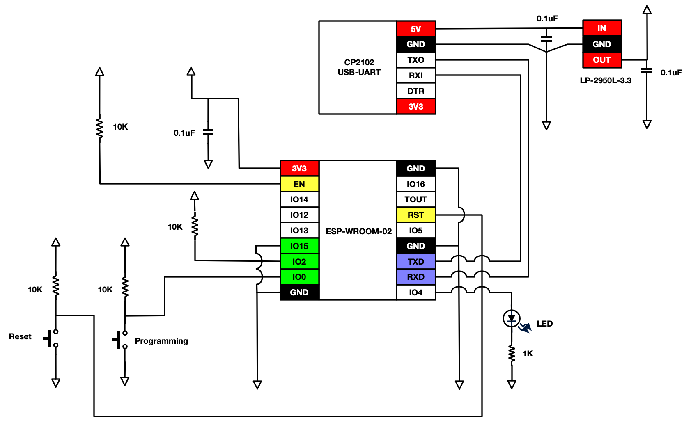
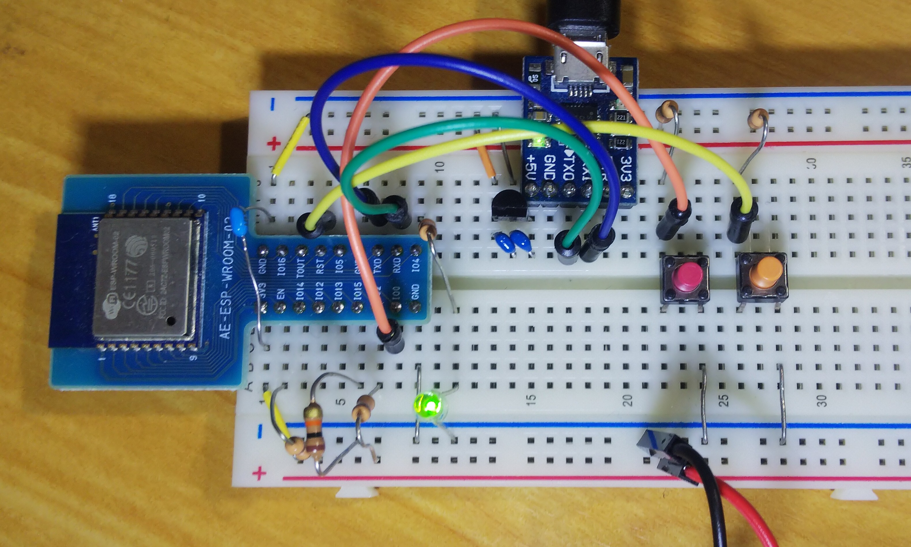

# ESP-WROOM-02 モジュールでの利用

espressif ESP8266EX を搭載したWiFi対応マイコン。tensilica L106(32Bitマイコン)コアを搭載する。技適対応。

* [ESP8266 WROOM Series](https://www.espressif.com/en/products/hardware/esp-wroom-02/overview)
* [秋月電子](http://akizukidenshi.com/catalog/g/gM-09607/)
* [Arduino core for ESP8266 WiFi chip](https://github.com/esp8266/Arduino)
* [ESP-WROOM-02 Datasheet](https://www.espressif.com/sites/default/files/documentation/0c-esp-wroom-02_datasheet_en.pdf)

## 配線

* UART Download(プログラミング)モードとFlash Boot(標準)では、2つのピンを設定してリセットすることで切り替わる。プログラミングはUART Downloadモードに切り替えてから行う。ここでは、**Programmingボタンを押しながらRestボタンを押す** プログラミング終了後は **Resetボタンを押す**ことで Flash Bootモードになり起動する。

* RTS,DTR ピンのあるUSB-UARTモジュールの場合、それぞれプルアップしてRST, IO0につなげると自動で切り替えが行えるらしい。[参照](https://github.com/esp8266/Arduino/blob/master/doc/boards.rst)。ここでは手作業で行うようにした。

Pin | UART Download | Flash Boot
------|---------------|------------
IO0   | Low           | floating or Pull Up
IO2   | High          | Pull Up(Not Care?)
IO15  | Low           | Pull Down(Not Care?)

## 設定

以下 の board_manager の項目に書き加える

* Linux: $HOME/.arduino15/arduino-cli.yaml 
* MacOS: $HOME/Library/Arduino15/arduino-cli.yaml

arduino-cli.yaml

	$ vim $HOME/.arduino15/arduino-cli.yaml
	board_manager:
	  additional_urls:
	  - https://arduino.esp8266.com/stable/package_esp8266com_index.json
	
コア一覧の更新

	$ arduino-cli core update-index

コア検索

	$ arduino-cli core search esp8266
	ID              Version Name
	esp8266:esp8266 2.6.3   esp8266
	
コアインストール

	$ arduino-cli core install esp8266:esp8266
	$ arduino-cli core list
	ID              Installed Latest Name
	arduino:avr     1.8.2     1.8.2  Arduino AVR Boards
	esp8266:esp8266 2.6.3     2.6.3  esp8266

ボードリスト、Genericを選ぶ

	$ arduino-cli board listall | grep 'Generic ESP8266'
	Generic ESP8266 Module           esp8266:esp8266:generic

接続されているボードリスト、汎用USB-UARTを使っているので、Unkownとなる

	$ arduino-cli board list
	Port         Type              Board Name FQBN Core
	/dev/ttyS0   Serial Port       Unknown
	/dev/ttyUSB0 Serial Port (USB) Unknown

スケッチを描く

	$ arduino-cli sketch new ESPBlink
	$ cat > ESPBlink/ESPBlink.ino << 'EOS'
	void setup(void) {
	    pinMode(4, OUTPUT);
	}

	void loop(void) {
	    digitalWrite(4, HIGH);
	    delay(1000);
	    digitalWrite(4, LOW);
	    delay(1000);
	}
	EOS
	
コンパイル

	$ arduino-cli compile --fqbn esp8266:esp8266:generic ESPBlink

アップロード

	$ arduino-cli upload -p /dev/ttyUSB0 --fqbn esp8266:esp8266:generic ESPBlink

